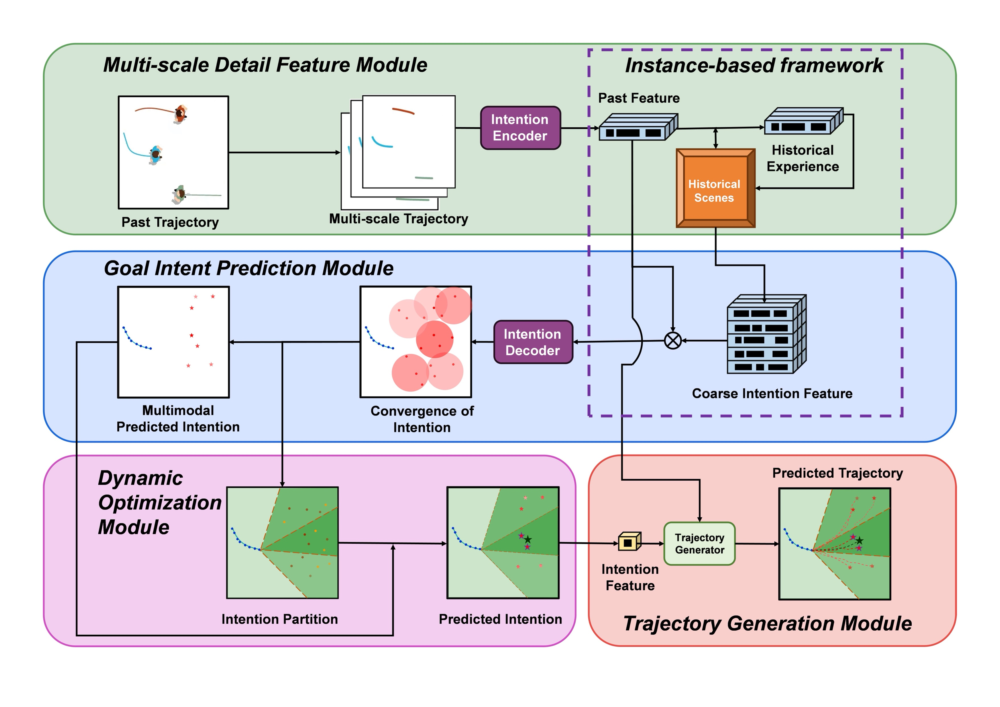








（个人介绍）Welcome to my homepage! I am a graduate with a M.S. degree in Transportation Information Engineering and Control, Jilin University, advised by Zhaowei Qu(曲昭伟). Prior to that, I obtained my Bachelor’s degree in Automotive Application Engineering from Jilin University. 

My research focuses on 

（研究兴趣）My research interest includes neural machine translation and computer vision. I have published more than 100 papers at the top international AI conferences with total <a href='https://scholar.google.com/citations?user=DhtAFkwAAAAJ'>google scholar citations <strong>260000+</strong></a> (You can also use google scholar badge ).

You can reach me via email at tramasterxxx@gmail.com. 🤝 I am actively seeking collaborations in Autonomous driving-related domains! If you’re interested in AI applications in AVs, trajectory prediction, probability analysis, or any related fields, feel free to reach out!

📋 Note: I am currently applying for 2026 PhD programs! If you are interested in my background, I’d love to receive your guidance. Also always happy to chat over coffee!

# 🔬 Research Interests

# 🔥 News
- *2025.10*: &nbsp;🎉🎉 One paper is accepted by IEEE Transactions on Neural Networks and Learning Systems(JCR Q1, IF=8.9). 

# 📝 Publications 

TNNLS 2025

[Deep Residual Learning for Image Recognition](https://openaccess.thecvf.com/content_cvpr_2016/papers/He_Deep_Residual_Learning_CVPR_2016_paper.pdf)

**Jiaheng Xiao**, Zhihui Li, Yu Sun, Mingxin Wang, Yu Xie, Qin Ma, Xin Wang

- Lorem ipsum dolor sit amet, consectetur adipiscing elit. Vivamus ornare aliquet ipsum, ac tempus justo dapibus sit amet. 

- [Lorem ipsum dolor sit amet, consectetur adipiscing elit. Vivamus ornare aliquet ipsum, ac tempus justo dapibus sit amet](https://github.com), A, B, C, **CVPR 2020**

# 🎖 Honors and Awards
- *2021.10* Lorem ipsum dolor sit amet, consectetur adipiscing elit. Vivamus ornare aliquet ipsum, ac tempus justo dapibus sit amet. 
- *2019.05* Lorem ipsum dolor sit amet, consectetur adipiscing elit. Vivamus ornare aliquet ipsum, ac tempus justo dapibus sit amet. 

# 📖 Educations
- *2021.06 - 2024.06*, Jilin University, M.S. degree. Transportation Information Engineering and Conctrol. 
- *2016.09 - 2020.06*, Jilin University, B.S. degree. Automotive Application Engineering.

# 💻 Exchanges
- *2022.02 - 2022.03*, Progerss on Smart Transportation in Singapore, NUS
